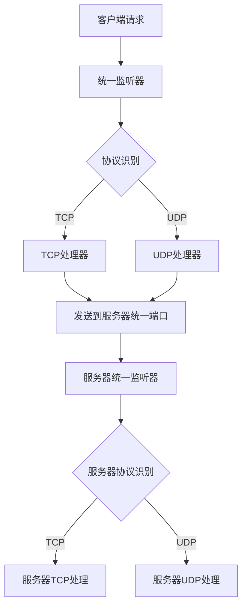

# 统一端口设计方案

## 1. 产品概述

将Shadowsocks项目中的TCP和UDP请求统一到同一个端口，实现客户端和服务端的单端口监听和自动协议识别。

## 2. 核心功能

### 2.1 用户角色

本设计不涉及用户角色区分，主要针对网络协议层面的统一处理。

### 2.2 功能模块

我们的统一端口方案包含以下主要模块：

1. **统一监听器模块**：单端口同时监听TCP和UDP请求
2. **协议识别模块**：自动识别incoming请求类型
3. **请求路由模块**：将请求转发到相应的处理器
4. **兼容性保持模块**：确保现有加密和协议兼容性

### 2.3 页面详情

| 模块名称 | 组件名称 | 功能描述 |
|----------|----------|----------|
| 统一监听器 | UnifiedListener | 创建单个端口监听器，同时绑定TCP和UDP套接字 |
| 协议识别器 | ProtocolDetector | 检测incoming数据包类型，区分TCP连接和UDP数据包 |
| TCP路由器 | TcpRouter | 将TCP连接路由到现有TCP处理逻辑 |
| UDP路由器 | UdpRouter | 将UDP数据包路由到现有UDP处理逻辑 |
| 配置管理器 | UnifiedConfig | 管理统一端口配置，向后兼容现有配置 |

## 3. 核心流程

### 客户端流程
1. 客户端启动统一监听器，在单个端口同时监听TCP和UDP
2. 接收到SOCKS5请求时，根据请求类型选择TCP或UDP处理
3. 向服务器发送请求时使用统一端口

### 服务端流程
1. 服务端启动统一监听器，在单个端口同时监听TCP和UDP
2. 接收到请求时自动识别协议类型
3. 根据协议类型路由到相应的处理逻辑

## 4. 用户界面设计

### 4.1 设计风格

本设计主要涉及后端架构，不涉及用户界面。配置方面保持现有的TOML配置文件格式，增加统一端口选项。

### 4.2 配置界面概述

| 配置项 | 参数名称 | 配置说明 |
|--------|----------|----------|
| 统一端口模式 | unified_port | 启用/禁用统一端口模式 |
| 统一端口号 | unified_port_number | 指定统一使用的端口号 |
| 向后兼容 | legacy_mode | 保持与现有分离端口模式的兼容性 |

### 4.3 响应性

配置系统支持动态切换，可以在统一端口模式和传统分离端口模式之间切换，确保向后兼容性。