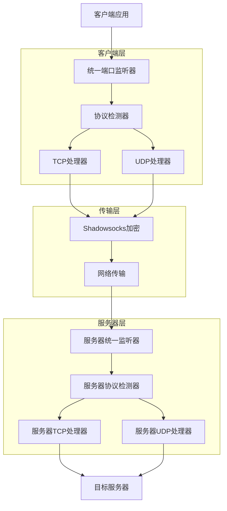
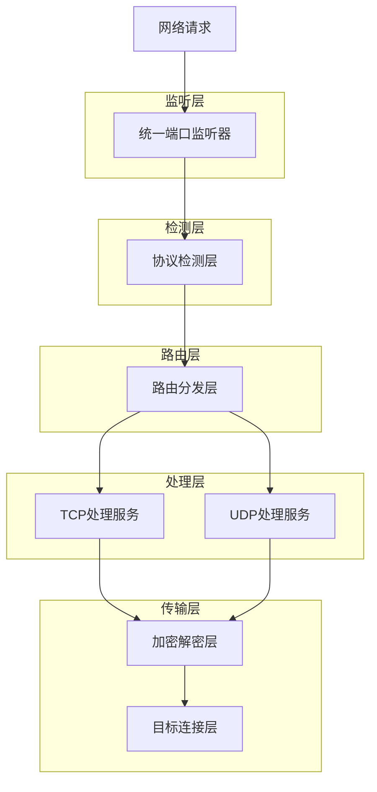
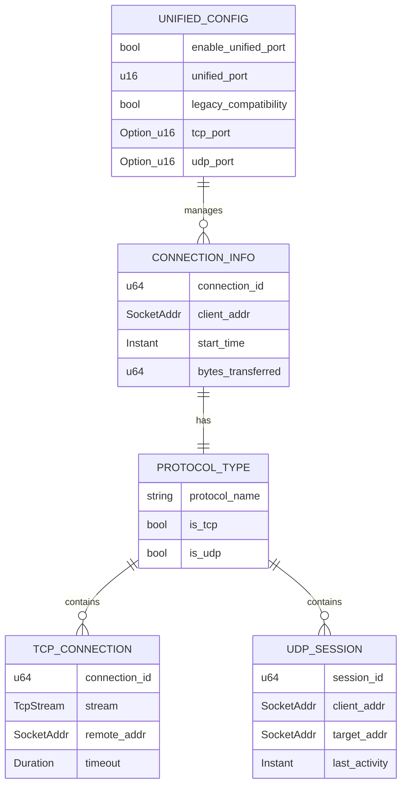

# 统一端口技术架构文档

## 1. 架构设计



## 2. 技术描述

* Frontend: 无（后端服务）

* Backend: Rust + Tokio + 现有Shadowsocks协议栈

* 核心组件: 统一端口监听器、协议检测器、路由器

## 3. 路由定义

| 协议类型   | 处理路径                                         | 说明              |
| ------ | -------------------------------------------- | --------------- |
| TCP连接  | UnifiedListener -> TcpDetector -> TcpHandler | TCP连接通过三次握手识别   |
| UDP数据包 | UnifiedListener -> UdpDetector -> UdpHandler | UDP数据包通过数据包特征识别 |
| 配置管理   | ConfigManager -> UnifiedConfig               | 统一配置管理          |

## 4. API定义

### 4.1 核心API

#### 统一监听器接口

```rust
// 统一端口监听器
pub struct UnifiedListener {
    tcp_listener: TcpListener,
    udp_socket: UdpSocket,
    port: u16,
}

impl UnifiedListener {
    /// 创建统一监听器
    pub async fn new(addr: SocketAddr) -> Result<Self>
    
    /// 启动监听循环
    pub async fn run(&mut self) -> Result<()>
    
    /// 停止监听
    pub async fn stop(&mut self) -> Result<()>
}
```

#### 协议检测器接口

```rust
// 协议检测器
pub enum ProtocolType {
    Tcp(TcpStream),
    Udp(UdpPacket),
}

pub struct ProtocolDetector;

impl ProtocolDetector {
    /// 检测协议类型
    pub fn detect(data: &[u8]) -> ProtocolType
    
    /// 验证协议有效性
    pub fn validate_protocol(protocol: &ProtocolType) -> bool
}
```

#### 统一配置接口

```rust
// 统一配置结构
#[derive(Debug, Clone, Serialize, Deserialize)]
pub struct UnifiedConfig {
    /// 是否启用统一端口模式
    pub enable_unified_port: bool,
    /// 统一端口号
    pub unified_port: u16,
    /// 向后兼容模式
    pub legacy_compatibility: bool,
    /// TCP端口（兼容模式）
    pub tcp_port: Option<u16>,
    /// UDP端口（兼容模式）
    pub udp_port: Option<u16>,
}
```

## 5. 服务器架构图



## 6. 数据模型

### 6.1 数据模型定义



### 6.2 数据定义语言

#### 统一配置表

```rust
// 配置结构定义
#[derive(Debug, Clone, Serialize, Deserialize)]
pub struct UnifiedPortConfig {
    /// 统一端口启用标志
    pub enable_unified_port: bool,
    /// 统一端口号
    pub unified_port: u16,
    /// 绑定地址
    pub bind_address: String,
    /// 向后兼容模式
    pub legacy_mode: bool,
    /// TCP超时设置
    pub tcp_timeout: Duration,
    /// UDP会话超时
    pub udp_session_timeout: Duration,
    /// 最大并发连接数
    pub max_connections: usize,
}

// 默认配置
impl Default for UnifiedPortConfig {
    fn default() -> Self {
        Self {
            enable_unified_port: false,
            unified_port: 8388,
            bind_address: "0.0.0.0".to_string(),
            legacy_mode: true,
            tcp_timeout: Duration::from_secs(300),
            udp_session_timeout: Duration::from_secs(60),
            max_connections: 1024,
        }
    }
}
```

#### 连接管理表

```rust
// 连接信息结构
#[derive(Debug, Clone)]
pub struct UnifiedConnectionInfo {
    /// 连接唯一标识
    pub connection_id: u64,
    /// 客户端地址
    pub client_addr: SocketAddr,
    /// 协议类型
    pub protocol: ProtocolType,
    /// 开始时间
    pub start_time: Instant,
    /// 最后活动时间
    pub last_activity: Instant,
    /// 传输字节数
    pub bytes_sent: u64,
    pub bytes_received: u64,
}

// 协议类型枚举
#[derive(Debug, Clone, PartialEq)]
pub enum ProtocolType {
    Tcp,
    Udp,
}
```

#### 初始化数据

```rust
// 测试配置初始化
pub fn create_test_unified_config() -> UnifiedPortConfig {
    UnifiedPortConfig {
        enable_unified_port: true,
        unified_port: 8388,
        bind_address: "127.0.0.1".to_string(),
        legacy_mode: false,
        tcp_timeout: Duration::from_secs(300),
        udp_session_timeout: Duration::from_secs(60),
        max_connections: 100,
    }
}

// 生产环境配置初始化
pub fn create_production_unified_config() -> UnifiedPortConfig {
    UnifiedPortConfig {
        enable_unified_port: true,
        unified_port: 443,
        bind_address: "0.0.0.0".to_string(),
        legacy_mode: true,
        tcp_timeout: Duration::from_secs(600),
        udp_session_timeout: Duration::from_secs(120),
        max_connections: 2048,
    }
}
```

